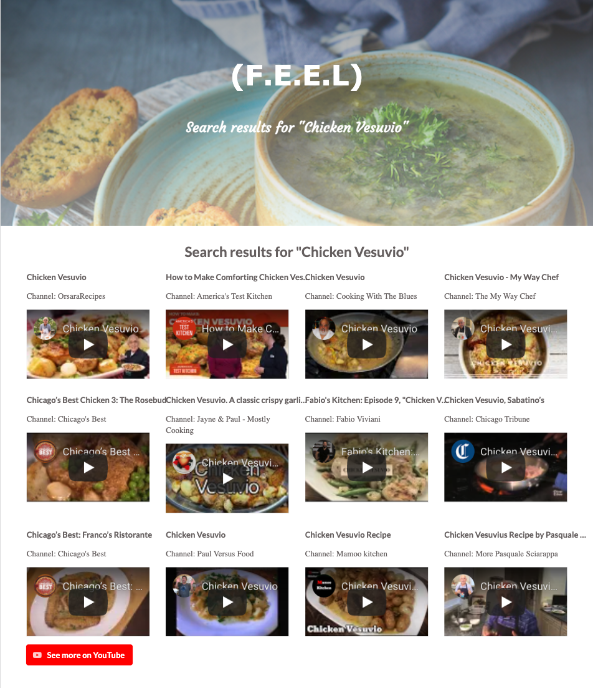

# FEEL

## The goal:

F.E.E.L (Find, Eat, Enjoy, Love) allows a user to search for a recipe based on cuisine preference and meal type; once the search populates the user can either read the text instruction or click the YouTube button to transport them to the collection of how-to videos.

## Technologies/frameworks: 
[Semantic UI](https://semantic-ui.com/), JavaScript, jQuery.
APIs: [Edamam](https://developer.edamam.com/edamam-docs-recipe-api), [YouTube](https://developers.google.com/youtube/v3/docs/search/list).

## Instructions: 
On the main page, type in your keyword in the search field, and click **Submit**. Optionally, you can choose **Meal Type** and **Cuisine Type** from the dropdown menus.

The search results with the recipes that match the keyword and selection will appear on the page.
Each recipe has **calories count**, **servings**, and **time to cook** fields, and a small image of the dish.

To see the ingredients needed for the meal, click the **Ingredients** button.
To see the text instructions for the recipe, click the recipe title.
To find videos on how to prepare the meal, click the **Find Videos** button.

The video results (10) will appear in a new tab. To see more search results on YouTube, click the **See more on YouTube** button.

[Deployed web app](https://vasylynash.github.io/FEEL/)

## License:

Copyright 2021 Vasylyna Shevadutska, David Whitesel & Emily Weagraff

Permission is hereby granted, free of charge, to any person obtaining a copy of this software and associated documentation files (the "Software"), to deal in the Software without restriction, including without limitation the rights to use, copy, modify, merge, publish, distribute, sublicense, and/or sell copies of the Software, and to permit persons to whom the Software is furnished to do so, subject to the following conditions:

The above copyright notice and this permission notice shall be included in all copies or substantial portions of the Software.

THE SOFTWARE IS PROVIDED "AS IS", WITHOUT WARRANTY OF ANY KIND, EXPRESS OR IMPLIED, INCLUDING BUT NOT LIMITED TO THE WARRANTIES OF MERCHANTABILITY, FITNESS FOR A PARTICULAR PURPOSE AND NONINFRINGEMENT. IN NO EVENT SHALL THE AUTHORS OR COPYRIGHT HOLDERS BE LIABLE FOR ANY CLAIM, DAMAGES OR OTHER LIABILITY, WHETHER IN AN ACTION OF CONTRACT, TORT OR OTHERWISE, ARISING FROM, OUT OF OR IN CONNECTION WITH THE SOFTWARE OR THE USE OR OTHER DEALINGS IN THE SOFTWARE.
